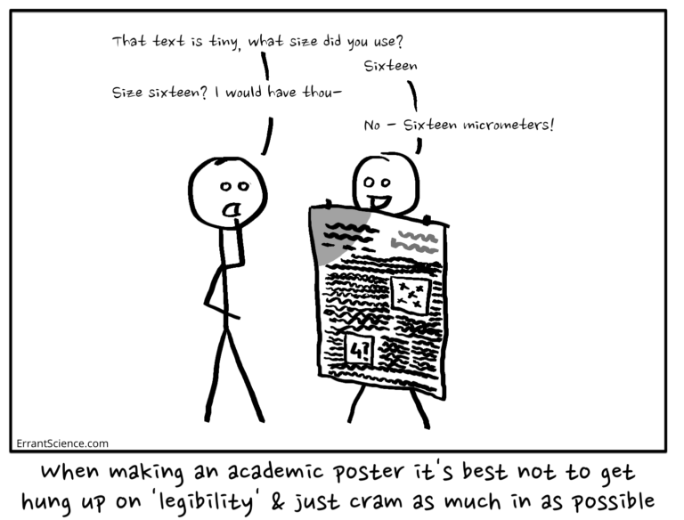
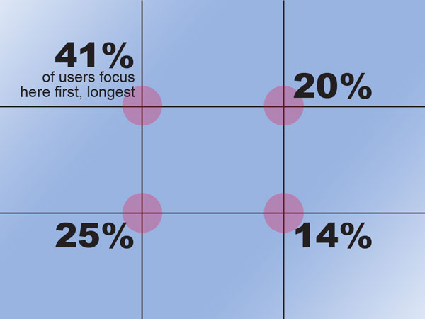
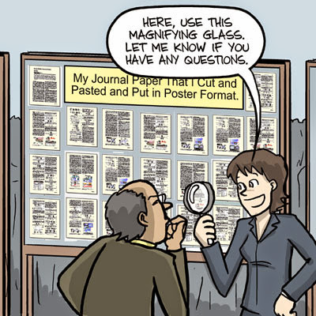
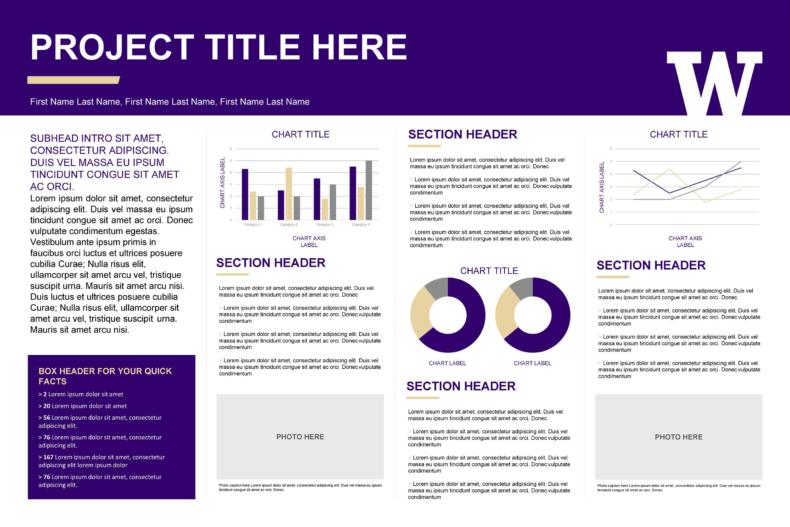

```{r setup, include=FALSE}
knitr::opts_chunk$set(echo = FALSE)
```

<div id="summary">
- A scientific poster helps to communicate the results of a particular study to an audience 
  - A poster should help the presenter communicate (serve as a visual aid/memory prompt), but should also be able to stand alone (communicate the work done without the author present to explain it)
- A poster should generally contain a title, list of authors, and several sections presenting the work: introduction, materials and methods, results, conclusions/significance
</div>


# Designing Your Poster 

Some general rules to keep in mind when designing your poster:

- Less is more
  - Everything on your poster *must count* - every single element has to contribute to the overall message you wish to convey. 
  - Once you have drafted your poster, examine each element on it individually and critically assess whether or not it is *essential* to convey your message to the audience. If it is not essential, it must go.^[Non-essential elements include everything from data that aren't relevant to the points you are making, to cute cartoons that only distract your reader.]
  - *No one* goes to a poster session at a scientific conference wanting to read a wall of dense text or look at fifty heat-maps. Identify the key points that you want to make, and the data that are important to prove those points, and make them shine by removing all extraneous or distracting items.
- Narrative flow: make it easy for your audience visually to understand where they should look first, when they first encounter your poster, and in what direction they should move through the sections.
- As you design your poster, keep your audience in mind (how much do they likely know about the topic already?)
- Clarity should be the bedrock of your poster presentation – avoid specialist jargon and acronyms, confusing figures, and muddled organisation. 

<div id="note">
No two scientific posters are the same - each will need slightly different sections and a different layout. The design principles laid out here are general guidelines only - they may be broken, where breaking them leads to more effective communication on your poster.
</div>

To design your poster, first [Identify the "Take-Home Message"], then [Identify the Content] you want to include on your poster, prepare a [First Draft], and finally [Edit] your poster to prepare the final draft. 


### Text

- Keep text on the poster to a minimum
  - Use bullet points instead of full sentences
  - Use figures instead of text (e.g., a diagram showing the steps done in an experiment instead of a written description)
  - Delete any unnecessary words
- All text should be large enough to read from several feet away 
- Use a dyslexia-friendly font like Arial
  - Use a monospace font like Courier for any nucleotide or protein sequence alignments


<div id ="goofus-gallant">
<div id="goofus">
*Bad example of a poster text box*

Introduction:

Cell division is a complex process requiring a number of different proteins assembled into the divisome. In *Escherichia coli*, these proteins include FtsZ, ZipA, FtsA, FtsW, FtsN, FtsB, FtsL, FtsQ, FtsI, FtsW, and many other proteins. FtsZ localizes to midcell and this localization is essential for correct positioning of the divisome and eventual construction of the cell division septum. In *Streptomyces*, however, *ftsZ* is not an essential gene. The aim of this work, therefore, is to discover why *ftsZ* is not essential in *Streptomyces* as it is in other bacteria.

</div>

<div id="gallant">
*Better example of a poster text box*

Cell division in bacteria:

- Divisome: protein complex required for cell division
- FtsZ needed for correct divisome positioning and septum formation
  - *ftsZ* essential in *E. coli* but not in *Streptomyces*
  
Aim:

- Discover why *ftsZ* is not essential in *Streptomyces*
</div>
</div>


<center>
```{r font size, echo=FALSE, fig.cap="Font size on an academic poster. Image credit: [ErrantScience](https://errantscience.com/blog/2016/02/23/how-to-prepare-an-academic-poster-a-terrible-guide-that-no-one-should-follow/)"}

```
</center>

## Graphic Design

- Make sure there is plenty of white space - do not crowd everything together to fit more in. 
- Guide the reader's eye to move naturally from one section to another in a logical order. 
  - It may help to number your sections, or to use arrows to guide the reader's eye.
- Align your boxes to a grid as much as possible - avoid complicated, messy jumbles that can make your poster feel cluttered and busy.
- Many posters use a plain coloured background, with white boxes or bubbles outlining the different subsections.

### Image placement

- Consider where you can place elements on your poster (text boxes, figures) for maximum effect. 
  - You may wish to follow the [Rule of Thirds](https://libguides.uwf.edu/c.php?g=262293&p=6646747), subdividing your poster into three sections each horizontally and vertically. Your audience's attention is naturally drawn to these lines or to their intersections.

<center>
```{r thirds, echo=FALSE, fig.cap="A diagram illustrating the rule of thirds and highlighting natural attention points on a poster. Image credit: [UWF poster guides](https://libguides.uwf.edu/c.php?g=262293&p=6646747)"}

```
</center>

### Colour choices

- Use a clear and consistent colour scheme throughout, ensuring that your colour choices are colour-blind accessible. 
- Make sure that there is enough contrast between any background colour and the font colour, such that the font is easy to read.
  - Dark fonts on a pale or white background are easiest to read.
- Do not use a bewildering array of colours; use 3-5 colours at most, and use them consistently throughout the poster. 
  - Use contrasting colours to draw your audience's attention to key points.
- Avoid messy, unnecessarily detailed backgrounds - these only distract from the poster content. 
- Overall, make sure that you use colour thoughtfully so that it aids in the clarity of your poster.  


# Introduction

Posters are a common way to communicate science at conferences and other venues. They are often printed on a single large sheet of paper (e.g., A0), but size requirements vary between conferences.

You should use your poster as a visual aid to presenting your work - it should have the key figures, results, etc. that you need to show your audience to convince them of the main findings of your work.

At the same time, however, your poster should be able to stand alone: a person should be able to look at it, without you being there to explain it, and still understand the work that you have done.

However, a poster is not a manuscript, and you cannot simply copy/paste figures and text from your thesis onto a poster template. A poster is primarily about visual communication, so text should be kept at a minimum and figures should be kept simple and clear.

<center>
```{r poster, echo=FALSE, fig.cap="A poster is not a manuscript, from [PhD Comics](http://phdcomics.com/comics.php)."}

```
</center>

# The Anatomy of a Scientific Poster

Every poster is different, but all posters should contain the following elements in some form. Boiled down to the essentials, the poster should inform your audience of why your research is important, the aims/hypothesis of your work, what experiments were done and how, and the overall conclusions/"take-home messages". 

There are many possible poster designs (just one example shown below), but it is common to use subheadings to divide the information on a poster, and to direct and focus the reader's attention. 

```{r template, echo=FALSE, fig.cap="Example poster template, from [Template Lab](https://templatelab.com/research-posters/)."}

```

## Title

- A short description of what the poster is about. May be a declarative statement of what the research has found, or a descriptive statement of what the research is about.   

## Authors

- Authors are usually listed directly below the title
- Everyone who has contributed to the work should be listed
- The person who prepared the poster (you) should be listed first, and the supervisor last
- Institutional affiliations should also be listed (e.g., University of Strathclyde)

## Introduction

- Gives enough background for the reader to understand your research question and why it is important. 
- Clearly sets out the aims and hypothesis for the work

## Materials and Methods

- Gives enough information for the reader to understand how the experiments were done
- Gives key parameters for the methods done, but not necessarily as detailed as a paper/thesis
- Often uses a figure/flow diagram to illustrate methods

## Results

- Includes key results that answer the stated hypothesis/research aims
- Uses subheadings to break into subsections as necessary
- Uses graphs or charts where necessary to illustrate key points

## Conclusions and Significance

- 1-3 clear, concise "take home" messages for your audience
- Usually relating back to the aims/hypothesis defined earlier
- May use a model figure to summarize results/put results in context

<div id="note">
The titles of the subsections on a poster may not match the sections listed above. For example, it is best to have clear, specific, focused titles that state the take-home message of a section (e.g., "Drug X decreases lymphocyte survival" instead of "Results").
</div>