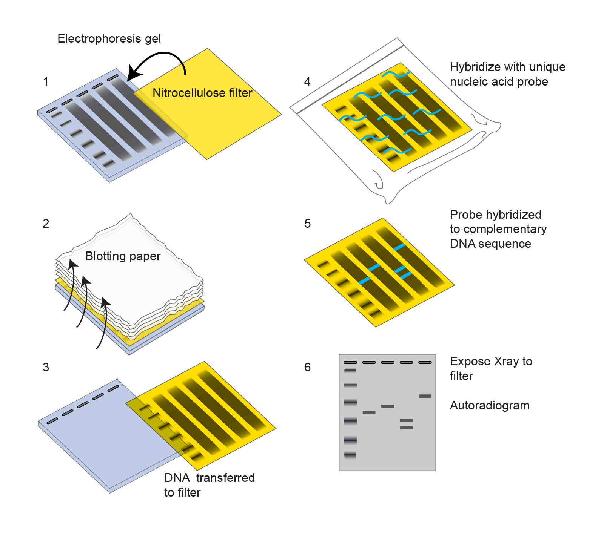

```{r setup, include=FALSE}
knitr::opts_chunk$set(echo = FALSE)
```

<div id="summary">
- Figures presented in your talk should be clear and informative, allowing the audience to easily and quickly understand the data that you present.
- Design decisions, including layout and the use of white space, colour choices, font size and choice, all matter in terms of making your figure clear and easy to interpret.
- Your figures should be designed with accessibility in mind: for example, you should use colourblind-friendly colour palettes, and dyslexia-friendly fonts. 
</div>

# Introduction

You have studied your journal club paper in detail and (hopefully!) understood all of the figures in it. It is important, when you choose and design the figures to present in your talk, to take a few moments to consider how a naive audience (one who hasn't seen the figure before) will perceive it. 

Unfortunately, many scientific figures are poorly designed. They are difficult to interpret, confuse the reader, and/or distract from the message that the authors mean to convey.

You are not expected to reanalyse the data from your paper or create new figures for it. In most cases, you will simply use the figures from your paper in your slides - however, you want to make sure that these figures are easy for your audience to read and understand; that you have presented the data in the best and clearest way.

```{r 1000words, fig.cap="A picture with a thousand words... [PhD Comics](http://phdcomics.com/comics/archive.php?comicid=1926)"}
knitr::include_graphics(rep("./images/phd022417s.gif"))
```

# Figures, Graphs, Tables

- You will want to include data in your talk to support your final conclusions/"take-home messages"; these data may be presented in different forms, including figures, graphs, or tables.

<div id="note">
In addition to using figures to present data from your paper, consider using figures in the introduction, materials & methods, and conclusions. 

- Model figures (e.g., blobograms that illustrate biological pathways) can be concise and clear ways to summarize the state of a field or to illustrate what your paper contributed to our understanding.
</div>

- Consider the best way to present the data (the easiest way for your audience to understand it). 
  - Generally speaking, visual representations (images, graphs, etc.) are better than tables or text in a presentation.
  
- Any figures present in your slides should be clear and easy to read. Avoid “chart-junk” and remove any unnecessary information that does not contribute to your main message/narrative. 

- Although there are some exceptions, in most cases you should restrict yourself to **one** figure per slide. Complex, multi-panel figures do not work well in a talk; to communicate your points clearly, remove any extraneous information (e.g., by cropping the figure to remove unnecessary panels).

- Likewise, not all of the figures or tables from your paper will fit into your talk: you must decide which are the most important/key points to include. (See [our guidelines on the content of a journal club presentation](./presentations-content.html) for more advice on identifying the take-home message and deciding which data to include.)
  - Do not try to cram in too much information, as it is better to present 2-3 experiments clearly than 10 experiments in a rushed, superficial way.
  - Once you have put together your talk and practiced it, check to make sure that you have mentioned every figure/item on your slides. If you haven't mentioned it in your talk, it is probably not important enough to be on your slides!
  

## Amending figures for journal club presentations

You may find it helpful to amend the figures that you present: for example, by using arrows, boxes, or circles to focus the audience's attention on key data, or by relabelling a figure to make it more readable. 

You may also find it helpful to use animation to present a figure bit by bit, revealing more data only when you are ready to talk about it. This helps to keep the audience listening to you as you speak, instead of spending too much time reading a complex figure, when it is presented all at once.

<div id="warning">
Do not mislead your audience! The figure should be a faithful representation of the data. You may find it helpful to simplify figures to present them in our journal club (and that is perfectly acceptable, so long as the data is still faithfully represented.) 

Omitting data (such as "outliers"), skewing the axes on a graph, or leaving out key information, can lead your audience to draw incorrect conclusions. Unscrupulous use of colour (highlighting some data to make it more prominent, or making some data appear linked when in fact they are not) can also be very problematic. Always double check your final figure to make certain that it represents the data correctly.
</div>

## Methods figures

- A methods figure (a flow chart illustrating the steps done in an experiment) is a concise and clear way of presenting how an experiment was done. 

- When describing a method used in your paper, you should give enough information for your audience to understand how the experiment(s) were done.

  - You should give key parameters for the methods done, but do not need to be as detailed as a paper/thesis - your audience needs to understand what was done; they don't need to be able to reproduce the experiment.

<center>
```{r methods-fig,  out.width="60%", out.height="60%", echo=FALSE, fig.cap="An example of a methods figure (in this case, for Southern blotting [from NIH](https://www.genome.gov/genetics-glossary/Southern-Blot))"}

```
</center>

## Remove distractions

You want your figures to tell a clear, easy to read message - this means that you should remove anything that might distract your audience from that message.  

- *Do* include the key data and all of the controls necessary to understand and interpret those data.
- *Don't* include any data that you do not discuss in the presentation. Crop the image or cover up unnecessary regions with boxes that match the background colour. 


## Figure aesthetics

It is also essential that you consider *accessibility*: is your figure accessible to a broad audience? Or does it rely on niche jargon specific to a particular field, colour palettes that are difficult/impossible for some readers to see, and/or fonts that are difficult for some readers to read?

Your audience will form an impression of your figure within the first 30 seconds (or less) of looking at it. First impressions matter - and you want that first impression to be pleasant, not an exercise in confusion or frustration.

The example below shows what a lot of work reading a figure can be, if a reader has to move their gaze back and forth between the key and the graph in order to figure out what the different colours represent and what the data are. The same principle applies to your figures - you want to make it easy for your audience to see and interpret the data. For example, it can be very helpful to relabel a gel figure so that the name of each sample is presented above the well in which that sample was run. 

```{r eyeroll, fig.cap="Tracing eye movements between a figure and the associated legend, From: [Junk Charts](https://junkcharts.typepad.com/junk_charts/2021/04/come-si-dice-donut-in-italiano.htmll)"}
knitr::include_graphics(rep("./images/tracing-eye-movement.png"))
```

### Colors

It is very tempting to use colour in scientific figures and in presentations, and the use of colour can, indeed, help to visualize data and communicate with your audience. But there are a number of important factors to consider when choosing to use colour in a figure/on a slide.

Consider how the reader will perceive the colours that you are using: 

- Do the colours help to illuminate key aspects of your data? Or do they distract from and/or distort the data? 
- Will all readers be able to clearly perceive differences between the colours you are using? 
- Do the colour choices correspond with our natural and/or cultural associations with those colours? (e.g., in general darker colours = more; blue = water; etc.)

```{r colour1, fig.cap="Choosing colours for a scientific figure, From: [Errant Science](https://blogs.egu.eu/divisions/gd/2017/08/23/the-rainbow-colour-map/)"}
knitr::include_graphics(rep("./images/colour-choices.jpg"))
```


# Text 

Any text present in a figure should be clear and easy to read. 

Some labels are essential for understanding a figure (e.g. axis labels, units, scale bars in micrographs). Too much text can be overwhelming, however, and make it take much longer for the reader to understand the figure. 

## Labels

Using a key or putting the data labels in the figure legend means that the reader has to do quite a lot of work to figure out what the data are (see Figure 2.1 and the example below).

In this figure showing a DNase I footprinting experiment, the labels on the right of the figure help the reader understand the relative positions of different nucleotides, and figure out where Region A and Region B are - these labels are very helpful.

However, the lanes are labelled only with numbers - the reader has to read and understand the legend, and then look back and forth between the legend and t he figure, to determine which sample is in each of the lanes. Where possible, it is better to label the data with brief, descriptive names.

```{r DNAseI, out.width="30%", out.height="30%", fig.cap="Figure example (DNase I footprint), with the figure legend: FIG. 4. DNase I footprint of NACWT and NACL111K bound to the nac promoter region. Radioactively labeled pCB1426 DNA was digested with DNase I in the presence of NACWT (lanes 2 to 6 [0, 0.9, 1.4, 2.2, and 4.4 pmol, respectively]) or NACL111K (lanes 7 to 11 [4.7, 9.5, 12.6, 12.6, and 25.2 pmol, respectively]). Lane 1 is the radiolabeled DNA without any DNase I treatment. Lane G is the G ladder. The solid line on the right of the footprint is the region protected by both NACWT and NACL111K. Arrowheads indicate the regions of DNase I hypersensitivity by NACWT, NACL111K, or both. From: [Rosario and Bender, 2020](https://doi.org/10.1128/JB.187.24.8291-8299.2005)"}
knitr::include_graphics(rep("./images/DNaseI-footprint.jpeg"))
```

<div id="warning">
While you may sometimes simplify a figure for the sake of presenting it well, it is essential that your figures still conform to scientific norms of data presentation. 
- Graph axes should be labelled, including correct scientific units
- Micrographs should include scale bars
- Text should be correctly formatted, including:
  - Gene and protein names correctly formatted
  - Binomial species names italicized
  - Correct formatting of any symbols, sub- or super- scripts, etc.
</div>

# Further reading on data presentation

- [Junk Charts](https://junkcharts.typepad.com/)

- [Nature Methods: Points of View columns](http://blogs.nature.com/methagora/2013/07/data-visualization-points-of-view.html)

- Rougier NP, Droettboom M, Bourne PE (2014) Ten Simple Rules for Better Figures. PLOS Computational Biology 10(9): e1003833. https://doi.org/10.1371/journal.pcbi.1003833

- Jambor H, Antonietti A, Alicea B, Audisio TL, Auer S, et al. (2021) Creating clear and informative image-based figures for scientific publications. PLOS Biology 19(3): e3001161. https://doi.org/10.1371/journal.pbio.3001161
