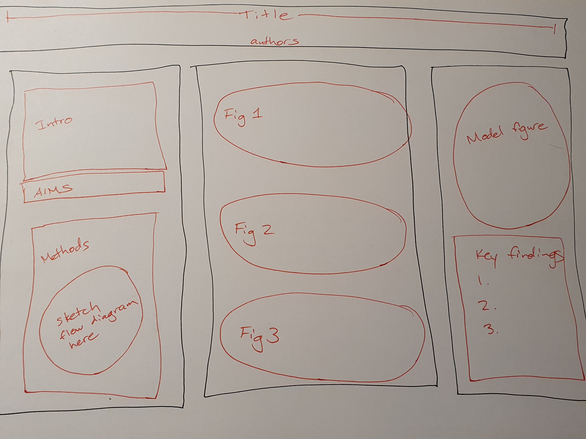
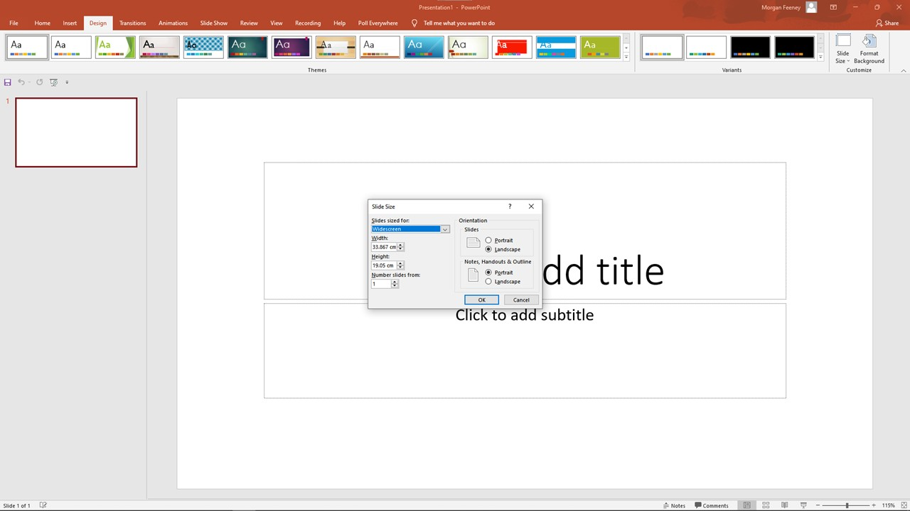

```{r setup, include=FALSE}
knitr::opts_chunk$set(echo = TRUE, warning = FALSE, message = FALSE)
library("dplyr")
library("ggplot2")

#import bgal data

bgal = read.table("./data/bgal-ex-csv.csv",
                         header=TRUE,
                         sep=",",
                         stringsAsFactors=TRUE)

bgal$Antibiotic = as.factor(bgal$Antibiotic)
```

<div id="summary">
- Your poster should tell a clear story about your project, and should serve as an aid for you as a presenter
- The design should be clear and clean, with the necessary information/key points and "take-home message" easy for your audience to see and understand

</div>

# Introduction

A poster should help the presenter communicate (serve as a visual aid/memory prompt), but should also be able to stand alone (communicate the work done without the author present to explain it)

Refer to the page on [the anatomy of a scientific poster](./posters.html) to review the components of a scientific poster. 

A good research poster tells a story, explaining:

1) the importance of your research (why you set out to answer the question), 
2) the aims and hypothesis of the study, 
3) the results, and 
4) the context and significance of these results to the field. 

The graphical layout of your poster should guide your reader through these points in order (e.g., using numbers or arrows between sections). 

<div id="warning">
Keep in mind that you are presenting to a non-specialist audience who may be unfamiliar with your specific area of research: your poster should convince them that your work is interesting and that you have answered an important scientific question.
</div>

<div id="note">
We have covered the [basics of figure preparation](./03-04-figure_preparation.html) in a previous workshop. Many of the same principles apply to poster design (careful choice of fonts and colour palettes, use of whitespace).
</div>

A poster is similar to a thesis or a research paper in that many of the same sections (methods, results, etc.) are usually present. However, you cannot simply cut and paste content from your thesis onto a poster - large blocks of text and complex multi-panel figures are not well-suited to the poster format. You want your poster to be as clear and concise as possible, preferring graphics over text and concise bullet points over long, complete sentences.


# How to Prepare a Poster

## First Draft

Once you have decided what information needs to be included on your poster, you may find it helpful to draw a rough sketch (on paper or electronically) of your poster layout first. 

```{r poster, echo=FALSE, fig.cap="A rough sketch of a poster layout"}

```

You can then start assembling the poster, adding images and text using the software of your choice. 

## Software

PowerPoint and Adobe programs are very commonly used. You may use any software you like to prepare your poster.

It is usually best to prepare your figures separately (using the software of your choice) --> save them as image files --> insert the figures into the poster as images. (Assembling the figures directly in the poster means that you will have many more movable pieces, and therefore more chances of those pieces being mis-aligned or lost.)

You want to keep in mind the size your figures will be printed at, and how they will appear at that resolution. The best practice here is to save images as vector files (.svg files) wherever possible, and for bitmaps use a suitable dpi for printing at A0 size, otherwise you can end up with very pixellated/poor quality images.

You can convert bitmaps to vector images in Adobe Illustrator/similar.


## Size

Your poster should be the size of an A0 paper (84.1 cm x 118.9 cm). 

If you are using PowerPoint, you can set the size of your poster by going to the "Design" ribbon, clicking on "Slide Size" > "Custom Slide Size" and entering the desired dimensions for Width and Height.

```{r poster-size, echo=FALSE, fig.cap="Adjusting slide size in PowerPoint"}

```

## Editing your poster

Once you have prepared a first draft of your poster, you will need to edit it. Practice presenting your poster in front of friends and/or colleagues, and note what works well (and what doesn't). Improve your poster based on their feedback. 

Things to keep in mind while you are editing your poster: 

- Remove any text or figures that do not help you present your project 
- Add any information that was missing (e.g., to answer any questions that your audience asked during your practice presentations)
- Consider the overall aesthetics of your poster (e.g., is the colour scheme working well, is there enough whitespace, does the reader naturally move through the sections in the intended order?)


